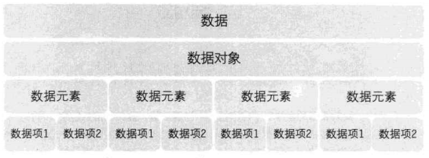
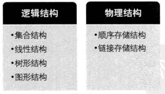

# 大话数据结构-读书笔记

## 第1章 数据结构绪论

> 数据结构是一门研究非数值计算的程序设计问题中的操作对象，以及它们之间的关系和操作等相关问题的学科。

### 数据的基本概念



#### 数据
> 数据是描述客观事物的符号，是计算机中可以操作的对象，是能被计算机识别，并输入给计算机处理的符号集合。

数据不仅包括整型、浮点型等数值类型，还包括字符及声音、图像、视频等非数值类型，其中声音、图像和视频等可以通过编码的手段变成字符数据来处理。

#### 数据元素
> 数据元素是组成数据的、有一定意义的基本单位，在计算机中通常作为整体处理。

#### 数据项
> 数据项是数据不可分割的最小单位，一个数据元素可以由若干个数据项组成。

#### 数据对象
> 数据对象是性质相同的数据元素的集合，是数据的子集。

在实际应用中，处理的数据元素通常具有相同性质，因此，一般地，数据对象可以简称为数据（在不产生的混淆的情况下）。

### 数据结构的基本概念

> 数据结构是相互之间存在一种或多种特定关系的数据元素的集合。



#### 逻辑结构
> 逻辑结构是指数据对象中数据元素之间的相互（逻辑）关系。

逻辑结构有四种：
1、集合结构：数据元素除了同属一个集合外，没有其他关系。类似于数学长的集合。
2、线性结构：数据元素之间是一对一的关系。
3、树形结构：数据元素之间是一对多的关系。
4、图形结构：数据元素之间是多对多的关系。

#### 物理结构
> 物理结构，又称存储结构，是指数据的逻辑结构在计算机中的存储形式。

物理结构的关键之处是正确反映数据元素之间的逻辑关系。

物理结构有两种：
1、顺序存储结构：数据元素存放在地址连续的存储单元，数据间的逻辑关系和物理关系一致
2、链式存储结构：数据元素存放在任意的存储单元，数据间的物理关系并不能反映逻辑关系

逻辑结构是面向问题的，物理结构是面向计算的，物理结构的基本目标就是将数据及其逻辑关系存储到计算机的内存中

### 抽象数据类型及其描述

#### 数据类型
> 数据类型是指一组性质相同的值的集合及定义在此集合上的一些操作的总称

#### 抽象数据类型
> 抽象数据类型（Abstract Data Type, ADT）是指一个数学模型及定义在该模型上的一组操作。

#### 描述抽象数据类型的标准格式
```
ADT 抽象数据类型名
Data
    数据元素之间逻辑关系的定义
Operation
    操作1
        初始条件
        操作结果描述
    操作2
        ......
    操作n
        ......
endADT
```