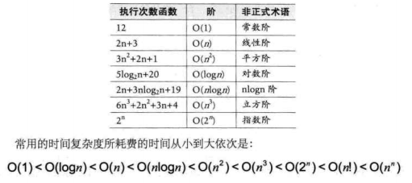

# 大话数据结构-读书笔记

## 第1章 数据结构绪论

> 数据结构是一门研究非数值计算的程序设计问题中的操作对象，以及它们之间的关系和操作等相关问题的学科。

### 一、数据的基本概念


#### 1、数据
> 数据是描述客观事物的符号，是计算机中可以操作的对象，是能被计算机识别，并输入给计算机处理的符号集合。

数据不仅包括整型、浮点型等数值类型，还包括字符及声音、图像、视频等非数值类型，其中声音、图像和视频等可以通过编码的手段变成字符数据来处理。

#### 2、数据元素
> 数据元素是组成数据的、有一定意义的基本单位，在计算机中通常作为整体处理。

#### 3、数据项
> 数据项是数据不可分割的最小单位，一个数据元素可以由若干个数据项组成。

#### 4、数据对象
> 数据对象是性质相同的数据元素的集合，是数据的子集。

在实际应用中，处理的数据元素通常具有相同性质，因此，一般地，数据对象可以简称为数据（在不产生的混淆的情况下）。

### 二、数据结构的基本概念

> 数据结构是相互之间存在一种或多种特定关系的数据元素的集合。


#### 1、逻辑结构
> 逻辑结构是指数据对象中数据元素之间的相互（逻辑）关系。

逻辑结构有四种：
1. 集合结构：数据元素除了同属一个集合外，没有其他关系。类似于数学长的集合。
2. 线性结构：数据元素之间是一对一的关系。
3. 树形结构：数据元素之间是一对多的关系。
4. 图形结构：数据元素之间是多对多的关系。

#### 2、物理结构
> 物理结构，又称存储结构，是指数据的逻辑结构在计算机中的存储形式。

物理结构的关键之处是正确反映数据元素之间的逻辑关系。

物理结构有两种：
1. 顺序存储结构：数据元素存放在地址连续的存储单元，数据间的逻辑关系和物理关系一致
2. 链式存储结构：数据元素存放在任意的存储单元，数据间的物理关系并不能反映逻辑关系

逻辑结构是面向问题的，物理结构是面向计算的，物理结构的基本目标就是将数据及其逻辑关系存储到计算机的内存中

### 三、抽象数据类型及其描述

#### 1、数据类型
> 数据类型是指一组性质相同的值的集合及定义在此集合上的一些操作的总称

#### 2、抽象数据类型
> 抽象数据类型（Abstract Data Type, ADT）是指一个数学模型及定义在该模型上的一组操作。

#### 3、描述抽象数据类型的标准格式
```
ADT 抽象数据类型名
Data
    数据元素之间逻辑关系的定义
Operation
    操作1
        初始条件
        操作结果描述
    操作2
        ......
    操作n
        ......
endADT
```

## 第2章 算法（绪论）

### 一、基础概念
#### 1、数据结构和算法的关系
数据结构和算法是密不可分的关系，两者相互依赖，相辅相成。

#### 2、算法的定义
> 算法是解决特定问题求解步骤的描述，在计算机中表现为指令的有限序列，并且每条指令表示一个或多个操作。

算法定义中提到的指令，是指能被人或计算机理解执行的，它可以是计算机中的指令，也可以是我们平时的语言文字。

#### 3、算法的特性
+ 输入：零个及以上个数的输入
+ 输出：一个及以上个数的输出
+ 有穷性：算法在执行有限步骤之后，自动结束（不会出现无限循环），且每一个步骤在可接受的时间内完成
+ 确定性：算法的每个步骤具有确定含义（无歧义）
+ 可行性：算法的每个步骤都是可行的

#### 4、（好）算法的设计要求
+ 正确性：至少应该具有输入、输出和加工处理无歧义性，能正确反映问题需求，能得到问题的正确答案
+ 可读性：便于阅读、理解和交流
+ 健壮性：当输入数据不合法时，算法也能做出相关处理，而不是产生异常或未知结果
+ 效率高（时间复杂度低）
+ 存储量低（空间复杂度低）

针对算法的“正确”，可分四个层次（一般情况下，将层次3作为一个算法正确性的检验标准）：
1. 算法程序没有语法错误
2. 算法程序对于合法的输入数据能够产生满足要求的输出结果
3. 算法程序对于非法的输入数据能够产生满足规格说明的结果
4. 算法程序对于精心选择的，甚至刁难的测试数据都有满足要求的输出结果

#### 5、算法效率的度量方法
+ 事后统计方法：缺陷较大，不予采纳
+ 事前分析估算方法

#### 6、函数的渐近增长
> 给定两个函数 $f(n)$ 和 $g(n)$，如果存在一个整数 $N$，使得对于所有的 $n>N$，$f(n)$ 总是比 $g(n)$ 大，那么我们说 $f(n)$ 的增长渐近快于 $g(n)$。

#### 7、算法时间复杂度
> **大 $O$ 记法**：$T(N)$ = $O(f(n))$

常见的时间复杂度：


一般在没有特殊说明的情况下，时间复杂度都是指最坏时间复杂度。

#### 8、算法空间复杂度
> **大 $O$ 记法**：$S(N)$ = $O(f(n))$

通常，“时间复杂度”指运行时间的需求，“空间复杂度”指空间需求，而当不用限定词地使用“复杂度”时，通常是指时间复杂度。


## 第3章 线性表

### 一、线性表的定义及抽象数据类型描述

#### 1、线性表的定义
> 线性表：零个或多个数据元素的**有限序列**。

+ 序列：数据元素之间是有顺序的，若元素存在多个，则第一个元素无前驱，最后一个元素无后驱，其他每个元素都且仅有一个前驱和后驱。
+ 有限：线性表的元素个数是有限的。事实上，在计算机中处理的对象都是有限的，无限数列只存在于数学的概念中。

#### 2、线性表的抽象数据类型描述
```
ADT 线性表（Linear list）
Data
    线性表的数据对象集合为 ${a1，a2,...,an}$，每个元素的类型相同。其中，除第一个元素$a1$外，每一个元素有且只有一个直接前驱元素，除了最后一个元素an外，每一个元素有且只有一个直接后继元素。数据元素之间的关系是一对一的关系。
Operation
    init()：初始化操作，建立一个空的线性表
    isEmpty()：若线性表为空，返回true，否则返回false
    clear()：清空线性表
    getElem(int i)：返回线性表中的第i个位置元素的值
    locateElem(T e)：查找与给定值e相等的元素，若查找成功，返回该元素在表中的序号，否则返回0表示失败
    insert(int i, T e)：在线性表中的第i个位置插入新元素e
    delete(int i)：删除线性表中第i个位置元素，并返回删除元素的值
    getLength()：返回线性表中元素个数
endADT
```